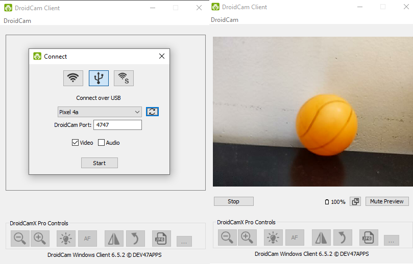
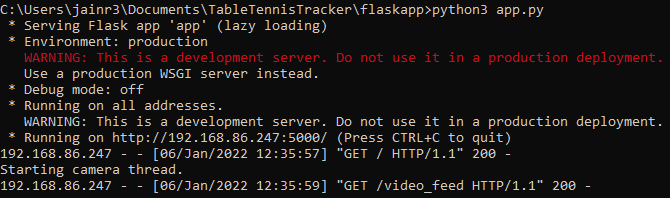

<div id="top"></div>

[![Contributors][contributors-shield]][contributors-url]
[![Forks][forks-shield]][forks-url]
[![Stargazers][stars-shield]][stars-url]
[![Issues][issues-shield]][issues-url]
[![MIT License][license-shield]][license-url]

<br/>
<div align="center">
  <a href="https://github.com/jainr3/TableTennisTracker">
    
  </a>

<h3 align="center">Table Tennis Tracker</h3>

  <p align="center">
    Tracks a table tennis ball as a game is being played.
    <br/>
    <a href="https://github.com/jainr3/TableTennisTracker"><strong>Explore the docs »</strong></a>
    <br/>
  </p>
</div>

<details>
  <summary>Table of Contents</summary>
  <ol>
    <li>
      <a href="#about-the-project">About The Project</a>
      <ul>
        <li><a href="#built-with">Built With</a></li>
      </ul>
    </li>
    <li>
      <a href="#getting-started">Getting Started</a>
      <ul>
        <li><a href="#prerequisites">Prerequisites</a></li>
        <li><a href="#installation">Installation</a></li>
      </ul>
    </li>
    <li><a href="#usage">Usage</a></li>
    <li><a href="#license">License</a></li>
    <li><a href="#contact">Contact</a></li>
    <li><a href="#acknowledgments">Acknowledgments</a></li>
  </ol>
</details>

## About The Project

[![Table Tennis Tracker Screen Shot][product-screenshot]](https://github.com/jainr3/TableTennisTracker)

This project tracks a table tennis ball as it moves around during gameplay.

<p align="right">[<a href="#top">Top</a>]</p>

### Built With

* [OpenCV](https://opencv.org/)
* [Flask](https://flask.palletsprojects.com/en/2.0.x/)

<p align="right">[<a href="#top">Top</a>]</p>

## Getting Started

Follow the steps to set up the project locally.

### Prerequisites

* Android device connected to your PC over USB cable
  * Can also use Raspberry Pi instead of PC
* DroidCam Android Application and Windows Client
  * See [here](https://www.dev47apps.com/) for download link
* Tripod with phone mount (Optional but recommended)

### Installation

1. Connect android device to PC over a USB cable. To make the connection, first enable developer options on the android device by going to Settings > About Phone and tapping the "Build Number" 7 times in a row. This will enable a new "Developer options" menu that is available under Settings or Settings > System. In the Developer Options menu, enable the USB debugging option. This will allow the PC to read data from the android device.

2. Now open the DroidCam application on the phone and open it on the PC as well. You might have to allow access to the camera / microphone on the phone side as well as accept any other permissions. After a few seconds, the phone will be automatically detected on the DroidCam Client on the PC as shown below. Be sure to select the "Connect over USB" option as that will provide the best latency versus sending the video stream over the internet.

<div align="center">
  
</div>

If you instead want to use a Raspberry Pi, install the Linux distribution of DroidCam. I used a premade [script](https://github.com/IM-TechieScientist/droidcam-raspberrypi-auto-install) and also had to install adb using the following command:
```sh
sudo apt-get install adb
```
The instructions at the original [source](https://www.dev47apps.com/droidcam/linux/) for linux doesn't translate exactly to Rasbperry Pi. There was also a small issue with the premade script which is discussed [here](https://github.com/IM-TechieScientist/droidcam-raspberrypi-auto-install/issues/2). Additional references that may be helpful: [1](https://github.com/dev47apps/droidcam), [2](https://github.com/dev47apps/droidcam/issues/6)

3. Next, clone the repository
   ```sh
   git clone https://github.com/jainr3/TableTennisTracker.git
   ```
4. Install the required libraries.
   ```sh
   pip3 install -r requirements.txt
   ```
5. Navigate to the flaskapp folder and run the following command.
   ```sh
   python3 app.py
   ```

<div align="center">
  
</div>

6. Then go to the url that appears to view the video stream!

<p align="right">[<a href="#top">Top</a>]</p>

## Usage

For best performance, mount the phone on a tripod. Then aim the phone's camera at the table so it is level with the surface and centered at the net.

<p align="right">[<a href="#top">Top</a>]</p>

## License

Distributed under the MIT License. See `LICENSE` for more information.

<p align="right">[<a href="#top">Top</a>]</p>

## Contact

Rahul Jain - rahul96jain@gmail.com

Project Link: [https://github.com/jainr3/TableTennisTracker](https://github.com/jainr3/TableTennisTracker)

<p align="right">[<a href="#top">Top</a>]</p>

## Acknowledgments

* [Cornell University ECE 5760 Spring 2015 Final Project](https://people.ece.cornell.edu/land/courses/ece5760/FinalProjects/s2015/ttt/ttt/ttt/index.html#top)
* [Ball Tracking Algorithm](https://www.pyimagesearch.com/2015/09/14/ball-tracking-with-opencv/)
* [Flask App Basics](https://www.pyimagesearch.com/2019/09/02/opencv-stream-video-to-web-browser-html-page/)
* [Flask App Reference](https://towardsdatascience.com/video-streaming-in-web-browsers-with-opencv-flask-93a38846fe00)
* [Flask + Basecamera setup](https://blog.miguelgrinberg.com/post/flask-video-streaming-revisited)
* [Ball Color Calibration](https://newbedev.com/choosing-the-correct-upper-and-lower-hsv-boundaries-for-color-detection-with-cv-inrange-opencv)
* [Ball Color Calibration Reference](https://www.pyimagesearch.com/2014/08/04/opencv-python-color-detection/)

<p align="right">[<a href="#top">Top</a>]</p>

[contributors-shield]: https://img.shields.io/github/contributors/jainr3/TableTennisTracker.svg?style=for-the-badge
[contributors-url]: https://github.com/jainr3/TableTennisTracker/graphs/contributors
[forks-shield]: https://img.shields.io/github/forks/jainr3/TableTennisTracker.svg?style=for-the-badge
[forks-url]: https://github.com/jainr3/TableTennisTracker/network/members
[stars-shield]: https://img.shields.io/github/stars/jainr3/TableTennisTracker.svg?style=for-the-badge
[stars-url]: https://github.com/jainr3/TableTennisTracker/stargazers
[issues-shield]: https://img.shields.io/github/issues/jainr3/TableTennisTracker.svg?style=for-the-badge
[issues-url]: https://github.com/jainr3/TableTennisTracker/issues
[license-shield]: https://img.shields.io/github/license/jainr3/TableTennisTracker.svg?style=for-the-badge
[license-url]: https://github.com/jainr3/TableTennisTracker/blob/master/LICENSE.txt
[product-screenshot]: img/screenshot.png