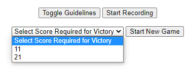
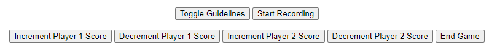

<div id="top"></div>

[![Contributors][contributors-shield]][contributors-url]
[![Forks][forks-shield]][forks-url]
[![Stargazers][stars-shield]][stars-url]
[![Issues][issues-shield]][issues-url]
[![MIT License][license-shield]][license-url]

<div align="center">
<h3 align="center">Table Tennis Tracker</h3>
  <p align="center">
    Tracks a table tennis ball as a game is being played and attempts to automatically keep score.
  </p>
</div>

<details>
  <summary>Table of Contents</summary>
  <ol>
    <li>
      <a href="#about-the-project">About The Project</a>
      <ul>
        <li><a href="#built-with">Built With</a></li>
      </ul>
    </li>
    <li>
      <a href="#getting-started">Getting Started</a>
      <ul>
        <li><a href="#prerequisites">Prerequisites</a></li>
        <li><a href="#installation">Installation</a></li>
      </ul>
    </li>
    <li><a href="#usage">Usage</a></li>
    <li><a href="#license">License</a></li>
    <li><a href="#contact">Contact</a></li>
    <li><a href="#acknowledgments">Acknowledgments</a></li>
  </ol>
</details>

## About The Project

<div align="center">
  <a href="https://github.com/jainr3/TableTennisTracker">
    
  </a>
</div>

This project tracks a table tennis ball as it moves around during gameplay. While in professional table tennis, the ball may be hit at much faster speeds, this project aims to track the ball at lower speeds using a regular mobile device camera. Additionally, the performance is highly dependent on the lighting conditions and overall environment setup. There are two ball tracking algorithms that are being used, both of which use a color based image map for orange table tennis balls. The color thresholds for "orange" may need to be adjusted as described in the calibration section. The first algorithm detects the contours of orange blobs as seen [here](https://www.pyimagesearch.com/2015/09/14/ball-tracking-with-opencv/). The second algorithm uses hotbox detection similar to [this project](https://people.ece.cornell.edu/land/courses/ece5760/FinalProjects/s2015/ttt/ttt/ttt/index.html).

<p align="right">[<a href="#top">Top</a>]</p>

### Built With

* [OpenCV](https://opencv.org/)
* [Flask](https://flask.palletsprojects.com/en/2.0.x/)

<p align="right">[<a href="#top">Top</a>]</p>

## Getting Started

Follow the steps to set up the project locally.

### Prerequisites

* Android device connected to your PC over USB cable (recommended)
  * Can also use Raspberry Pi instead of PC (from testing it seems to be slower)
* DroidCam Android Application and Windows Client
  * See [here](https://www.dev47apps.com/) for download link
* Tripod with phone mount (Optional but recommended)

### Installation

1. Connect android device to PC over a USB cable. To make the connection, first enable developer options on the android device by going to Settings > About Phone and tapping the "Build Number" 7 times in a row. This will enable a new "Developer options" menu that is available under Settings or Settings > System. In the Developer Options menu, enable the USB debugging option. This will allow the PC to read data from the android device.

2. Now open the DroidCam application on the phone and open it on the PC as well. You might have to allow access to the camera / microphone on the phone side as well as accept any other permissions. After a few seconds, the phone will be automatically detected on the DroidCam Client on the PC as shown below. Be sure to select the "Connect over USB" option as that will provide the best latency versus sending the video stream over the internet. To get better resolution, you might want to enable HD mode by watching an ad on the android device. Also, the PC application should have a setting to increase resolution (you may have to restart the computer).

<div align="center">
  
</div>

If you instead want to use a Raspberry Pi, install the Linux distribution of DroidCam. I used a premade [script](https://github.com/IM-TechieScientist/droidcam-raspberrypi-auto-install) and also had to install adb using the following command:
```sh
sudo apt-get install adb
```
The instructions at the original [source](https://www.dev47apps.com/droidcam/linux/) for linux doesn't translate exactly to Rasbperry Pi. There was also a small issue with the premade script which is discussed [here](https://github.com/IM-TechieScientist/droidcam-raspberrypi-auto-install/issues/2). Additional references that may be helpful: [1](https://github.com/dev47apps/droidcam), [2](https://github.com/dev47apps/droidcam/issues/6). The Raspberry Pi + DroidCam + Android over USB seemed to give a delayed video feed, so the PC method is recommended. Also if you are using the Raspberry Pi, modify the camera source in the camera.py file as the comments advise.

3. Next, clone the repository
   ```sh
   git clone https://github.com/jainr3/TableTennisTracker.git
   ```
4. Install the required libraries.
   ```sh
   pip3 install -r requirements.txt
   ```

<p align="right">[<a href="#top">Top</a>]</p>

## Usage

### Calibration

1. For best performance, mount the phone on a tripod. Then aim the phone's camera at the table so it is level with the surface and centered at the net. Assume that the humans are out of the camera frame. Also make sure there is enough light in the environment. I had to switch out yellow light bulbs with bulbs that give white light.

<div align="center">
  
</div>

2. Place a couple of ping pong balls around the table. I used orange because it contrasts well with the environment. Take a photo of the setup with the ping pong balls and place it in the img directory as 'calibrate.png'. Now, run the calibration script ([source](https://stackoverflow.com/a/59906154)) to figure out the best masking for the color of the ping pong ball. Keep changing the sliders until only the ping pong ball(s) remain in the image. For my setup it looked like the following.

   ```sh
   python3 calibrate_color.py
   ```

<div align="center">
  
</div>

<div align="center">
  
</div>

3. Now take the number range in the sliders and in camera.py, modify the colorLower and colorUpper tuples. The script should now be calibrated for the environment. To confirm, run the confirmation script using the following command. There may be some noise, as in the case of my example, where a ping pong racket was partially detected.

   ```sh
   python3 confirm_mask.py
   ```

<div align="center">
  
</div>

### Running the flask app

1. Navigate to the flaskapp folder and run the following command.
   ```sh
   python3 app.py
   ```

<div align="center">
  
</div>

2. Then go to the url that appears to view the video stream!

<p align="right">[<a href="#top">Top</a>]</p>

### Accessing the admin page

1. Once the application is running, go to the /login page to login as the administrator. The administrator credentials are: 
   ```sh
   Username: admin
   Password: admin
   ```
   In the future, a real database can be connected to allow for more roles and to obfuscate these credentials.

<div align="center">
  
</div>

2. After logging in, the video stream will appear along with some controls to manage table tennis games. The admin has the option to start a game, begin recording, add/subtract points, and end a game.

<div align="center">
  
</div>

When a game is active, the following options will appear.

<div align="center">
  
</div>

### Gameplay and automatic scoring

The gameplay is tracked via a state machine [(original source)](https://people.ece.cornell.edu/land/courses/ece5760/FinalProjects/s2015/ttt/ttt/ttt/images/fsm.png).

<div align="center">
  
</div>

To start serving, the server should raise the ball within camera's field of vision until it is above a certain height and a chime is heard. Then the server may begin their serve. The rest of the state transitions follow the diagram where the computer attempts to detect bounces, hits, timeouts, and ball side switches. 

### Camera Debug Mode

The Camera has a debug mode as indicated by the flag in the Camera class. When set to true, the debug mode will enable hotbox tracking for the ball, display text whenever a bounce or hit is detected, as well as display the state machine's current state on the camera feed.

## Future Improvements

There is definitely room for improvement in the project. Some of these areas include:

* Lighting condition calibration, Hotbox detection
* Higher frame rate camera + processing capabilities to prevent "blur"
* Unhandled states in the state machine such as ball hitting the net but still going over

Example of "blur"

<div align="center">
  
</div>

## License

Distributed under the MIT License. See `LICENSE` for more information.

<p align="right">[<a href="#top">Top</a>]</p>

## Contact

Rahul Jain - rahul96jain@gmail.com

Project Link: [https://github.com/jainr3/TableTennisTracker](https://github.com/jainr3/TableTennisTracker)

<p align="right">[<a href="#top">Top</a>]</p>

## Acknowledgments

* [Cornell University ECE 5760 Spring 2015 Final Project](https://people.ece.cornell.edu/land/courses/ece5760/FinalProjects/s2015/ttt/ttt/ttt/index.html#top)
* [Ball Tracking Algorithm](https://www.pyimagesearch.com/2015/09/14/ball-tracking-with-opencv/)
* [Flask App Basics](https://www.pyimagesearch.com/2019/09/02/opencv-stream-video-to-web-browser-html-page/)
* [Flask App Reference](https://towardsdatascience.com/video-streaming-in-web-browsers-with-opencv-flask-93a38846fe00)
* [Flask + Basecamera setup](https://blog.miguelgrinberg.com/post/flask-video-streaming-revisited)
* [Flask Login](https://github.com/maxcountryman/flask-login)
* [Ball Color Calibration](https://newbedev.com/choosing-the-correct-upper-and-lower-hsv-boundaries-for-color-detection-with-cv-inrange-opencv)
* [Ball Color Calibration Reference](https://www.pyimagesearch.com/2014/08/04/opencv-python-color-detection/)

<p align="right">[<a href="#top">Top</a>]</p>

[contributors-shield]: https://img.shields.io/github/contributors/jainr3/TableTennisTracker.svg?style=for-the-badge
[contributors-url]: https://github.com/jainr3/TableTennisTracker/graphs/contributors
[forks-shield]: https://img.shields.io/github/forks/jainr3/TableTennisTracker.svg?style=for-the-badge
[forks-url]: https://github.com/jainr3/TableTennisTracker/network/members
[stars-shield]: https://img.shields.io/github/stars/jainr3/TableTennisTracker.svg?style=for-the-badge
[stars-url]: https://github.com/jainr3/TableTennisTracker/stargazers
[issues-shield]: https://img.shields.io/github/issues/jainr3/TableTennisTracker.svg?style=for-the-badge
[issues-url]: https://github.com/jainr3/TableTennisTracker/issues
[license-shield]: https://img.shields.io/github/license/jainr3/TableTennisTracker.svg?style=for-the-badge
[license-url]: https://github.com/jainr3/TableTennisTracker/blob/master/LICENSE.txt